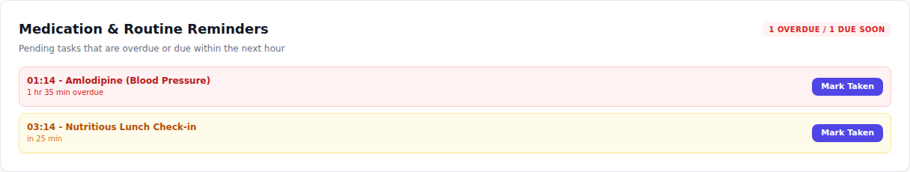
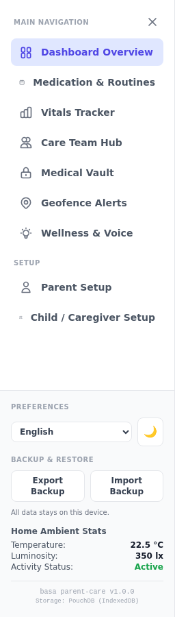
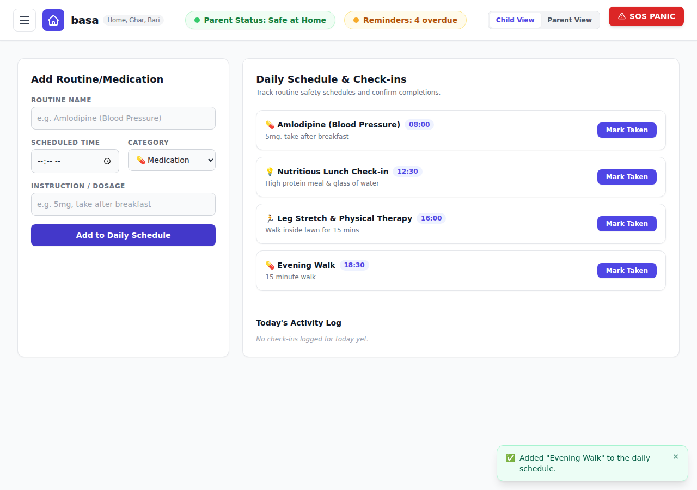
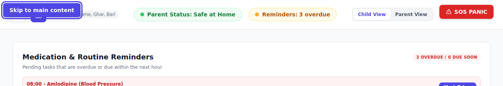

# Basa

**Home, Ghar, Bari** - an elder care circle dashboard for families looking after an ageing parent.

Basa is a single-page, offline-first web app: no server, no account and care records stay on the
device. Open `index.html` (or the live demo) and everything - routines, vitals, care notes, vault
records and profiles - is stored locally in the browser. The only exception is an outbound
IP-based country lookup used to show the correct local emergency numbers (see [Privacy](#privacy)).

## Contents

- [Live Demo](#live-demo)
- [Quick Start](#quick-start)
- [Everyday Use](#everyday-use)
- [Accessibility & Keyboard](#accessibility--keyboard)
- [Features](#features)
- [Project Structure](#project-structure)
- [Testing](#testing)
- [Data Storage](#data-storage)
- [Privacy](#privacy)
- [Screenshots](#screenshots)

## Live Demo
<!-- LIVE_DEMO_START -->
🚀 **Live site:** https://charles2ke.github.io/basa/

**Latest deployment run:** https://github.com/charles2ke/basa/actions/runs/35052144192
<!-- LIVE_DEMO_END -->

## CI/CD Status
<!-- BUILD_STATUS_START -->


**Last Automated Update:** Wed, 16 Sep 2026 03:32:39 GMT
<!-- BUILD_STATUS_END -->

## Test Coverage Metrics
<!-- COVERAGE_START -->


| Metric | Total | Covered | Percentage |
| :--- | :---: | :---: | :---: |
| **Lines** | 1445 | 1428 | 98.82% |
| **Statements** | 1570 | 1526 | 97.19% |
| **Functions** | 194 | 185 | 95.36% |
| **Branches** | 739 | 643 | 87% |
<!-- COVERAGE_END -->

## Quick Start

No build step is required - the app is plain HTML, CSS and JavaScript.

```bash
git clone https://github.com/charles2ke/basa.git
cd basa
npm install          # only needed for the test tooling
npm run serve        # serves the app on http://localhost:8080
```

Then open <http://localhost:8080> in a modern browser (Chrome, Edge, Firefox or Safari).
Opening `index.html` directly from disk also works, although the offline PouchDB store is more
reliable when the page is served over `http://`.

**Requirements:** Node.js 20+ is only needed for `npm run serve` and the test suites; the app
itself needs nothing but a browser.

## Everyday Use

1. **Set up profiles first.** Open the hamburger drawer and fill in *Parent Setup* and
   *Child / Caregiver Setup*. Several parents and several caregivers can be added and switched
   between.
2. **Add routines and medication** on the *Medication & Routines* tab; overdue or imminent items
   surface at the top of the dashboard and in the amber header badge.
3. **Log vitals** manually or connect Google Fit, Garmin or Whoop and press **Sync Now**.
4. **Switch to Parent View** (header toggle) for the larger, elderly-friendly layout.
5. **Export a backup** from the drawer before switching devices or clearing browser data.

Every action now confirms itself with a small toast in the corner of the screen rather than a
blocking pop-up dialog.

## Accessibility & Keyboard

- **Skip link:** press `Tab` on load to reveal *Skip to main content* and jump past the header.
- **Navigation drawer:** the hamburger drawer traps `Tab` / `Shift+Tab` while open, closes on
  `Esc` or a backdrop click, and returns focus to the hamburger button afterwards.
- **Focus rings:** every button, link and field shows a high-contrast indigo focus outline when
  reached with the keyboard.
- **Announcements:** toasts render inside an `aria-live` region so screen readers read them out.
- **Reduced motion:** the bouncing SOS button and pulsing badges stop animating when the
  operating system requests reduced motion.
- **Parent View:** larger type, bigger touch targets and simplified controls for the parent.
- **Languages & theme:** English, Hindi and Bengali plus light/dark mode, remembered per device.

## Features
- **Smart Ambient Telemetry**: Real-time monitoring of motion sensors, temperature, and environmental status.
- **Geofencing & Alerts**: Safe boundaries visual tracking with automated alerts.
- **Elder Care Circle**: Collaborative platform for scheduling appointments, routines tracking, and caregiver logs sharing.
- **Wearable Sync**: Connect Google Fit, Garmin or Whoop from the Vitals tab and pull the latest readings on demand with the manual **Sync Now** button.
- **Medication Reminders**: The dashboard overview lists every pending routine that is overdue or due within the next hour, and an amber counter in the header links straight to the daily schedule.
- **Backup & Restore**: Export every on-device record to a timestamped JSON file from the hamburger menu, and import it again on another browser or device.
- **Medical Vault**: Securely encrypted health report logs and prescription storage.
- **Wellness Games**: Brain-training matching games for cognitive engagement.
- **Hamburger Navigation**: The main navigation lives in an off-canvas drawer opened from the header hamburger button on every screen size.
- **Setup Pages**: Dedicated Parent Setup and Child/Caregiver Setup pages for profiles, contacts and alert preferences.
- **Languages**: The whole interface can be switched between English, Hindi (हिन्दी) and Bengali (বাংলা) from the language picker in the hamburger menu; the choice is remembered on the device.
- **Dark & Light Mode**: A toggle in the hamburger menu switches between the light and dark colour scheme, also remembered between visits.
- **Multiple Profiles**: Both setup pages keep a list of profiles, so several parents and several children/caregivers can be added, switched between and removed.
- **Local Emergency Numbers**: Police, ambulance and fire numbers resolved from the visitor's IP location, with a manual country override. Each card is a `tel:` link, so tapping one opens the phone dialler on mobile.
- **Offline NoSQL Storage**: All data is stored on-device in [PouchDB](https://pouchdb.com/), a free and open source NoSQL document database backed by IndexedDB.
- **Mobile Friendly**: Fully responsive layout with stacked cards and touch-friendly controls.
- **Toast Confirmations**: Saving a routine, vital, note, vault record or backup confirms with a dismissible toast in an `aria-live` region instead of a blocking dialog.
- **Keyboard & Screen Reader Friendly**: Skip-to-content link, focus-trapped navigation drawer, visible focus rings and `prefers-reduced-motion` support.

## Project Structure

| Path | Purpose |
| :--- | :--- |
| `index.html` | Entire markup: header, navigation drawer and every tab panel. |
| `app.js` | Application state, rendering and all interaction handlers. |
| `db.js` | `BasaDB` persistence wrapper (PouchDB + `localStorage` mirror). |
| `i18n.js` | English / Hindi / Bengali dictionaries keyed by the English phrase. |
| `styles.css` | Custom styles on top of Tailwind: drawer, toasts, dark mode, parent view. |
| `tests/unit` | Jest + JSDOM unit tests for `app.js` and `db.js`. |
| `tests/e2e` | Playwright end-to-end and responsive layout tests. |
| `scripts/update-readme.js` | CI helper that refreshes the badges and metrics above. |

## Testing

```bash
npm test             # Jest unit tests (JSDOM)
npm run test:coverage  # unit tests with a coverage report in coverage/
npm run test:e2e     # Playwright end-to-end tests (starts the dev server automatically)
```

Playwright browsers are installed once with `npx playwright install --with-deps chromium`.
The GitHub Actions pipeline runs the unit tests with coverage, deploys to GitHub Pages and
rewrites the badge sections of this file.

## Data Storage
State is persisted through `db.js`, a thin wrapper around PouchDB (Apache-2.0, vendored in `vendor/pouchdb.min.js`). Each collection - routines, vitals, care events, notes, vault documents, geofence settings, parent/child profile lists and the detected emergency location - is stored as its own document. A synchronous `localStorage` mirror keeps the first paint instant and acts as a fallback when IndexedDB is unavailable; per-key write timestamps prevent an older database document from overwriting a newer local write.

## Privacy

Basa has no backend. Records live in the browser's IndexedDB (with a `localStorage` mirror) and
are only shared when *you* export a backup file. The only outbound request is an IP-based country
lookup used to show the correct local emergency numbers, and that can be overridden manually.

## Screenshots

### Dashboard Overview
Daily snapshot of your parent's status: ambient telemetry, safety alerts, medication routines, and the SOS panic protocol.


### Medication & Routines
Daily medication and routine checklists with completion progress bars.


### Vitals Tracker
Blood pressure, pulse, glucose, and temperature logging with SVG trend charts and a historic readings table. Google Fit, Garmin and Whoop can be connected from the same tab; each connected platform contributes the metrics its devices measure and **Sync Now** merges them into today's reading.


### Care Team Hub
Shared caregiver workspace for coordinating appointments, shift notes, and live caregiver updates.


### Medication & Routine Reminders
Pending routines that are overdue or due within the next hour are surfaced at the top of the overview, each with a one-tap **Mark Taken** button. When something is overdue an amber **Reminders** badge appears in the header and jumps to the daily schedule.



### Backup & Restore
**Export Backup** in the hamburger drawer downloads every routine, vital, care note, vault record, profile and preference as a single JSON file; **Import Backup** restores that file onto any device. Nothing is uploaded anywhere - the data never leaves the browser.



### Toast Confirmations & Skip Link
Saving a routine, vital, care note, vault record or backup confirms with a dismissible toast in the
corner of the screen (announced through an `aria-live` region) instead of a blocking dialog. Pressing
`Tab` on load reveals the *Skip to main content* link.

| Toast confirmation | Skip to main content |
| :---: | :---: |
|  |  |

### Medical Vault
Categorized, searchable archive of health reports, prescriptions, and insurance documents.


### Geofence Alerts
Configurable safe-zone radius with wandering simulation that triggers automatic alerts.


### Wellness & Voice
Brain-training memory match game plus live speech-to-text voice commands (Web Speech API) for hands-free routine updates, with a typed fallback.


### Languages (English, Hindi, Bengali)
The language picker in the hamburger drawer translates the interface into Hindi (हिन्दी) or Bengali (বাংলা); untranslated phrases fall back to English.


### Dark Mode
A toggle in the hamburger drawer switches the whole dashboard between the light and dark colour scheme.


### Hamburger Navigation
The main navigation, language picker and dark mode toggle are tucked behind the header hamburger button and slide in as a drawer, closing on selection, backdrop click, or `Esc`.


### Parent Setup
Capture the parent's identity, home address, medical background and accessibility preference.


### Child / Caregiver Setup
Caregiver contact details, a backup contact, and per-channel alert preferences.


### Local Emergency Numbers
Police, ambulance and fire numbers for the country detected from the visitor's IP address, with a manual override. Tapping a card dials the number on mobile devices.


### Mobile & Responsive Layout
The dashboard adapts from phones to desktops: the header wraps into compact rows, the sidebar becomes a horizontally scrollable tab strip, cards stack into a single column, and wide tables scroll horizontally instead of breaking the page.

| Overview (mobile) | Vitals (mobile) |
| :---: | :---: |
|  |  |

The same hamburger drawer is used on phones:


