# Basa
Home, Ghar, Bari - Elder Care Circle Dashboard.

## Live Demo
<!-- LIVE_DEMO_START -->
🚀 **Live site:** https://charles2ke.github.io/basa/

**Latest deployment run:** https://github.com/charles2ke/basa/actions/runs/33061818260
<!-- LIVE_DEMO_END -->

## CI/CD Status
<!-- BUILD_STATUS_START -->

**Last Automated Update:** Thu, 27 Aug 2026 10:10:30 GMT
<!-- BUILD_STATUS_END -->

## Test Coverage Metrics
<!-- COVERAGE_START -->

| Metric | Total | Covered | Percentage |
| :--- | :---: | :---: | :---: |
| **Lines** | 1044 | 1034 | 99.04% |
| **Statements** | 1117 | 1100 | 98.47% |
| **Functions** | 134 | 132 | 98.5% |
| **Branches** | 479 | 424 | 88.51% |
<!-- COVERAGE_END -->

## Features
- **Smart Ambient Telemetry**: Real-time monitoring of motion sensors, temperature, and environmental status.
- **Geofencing & Alerts**: Safe boundaries visual tracking with automated alerts.
- **Elder Care Circle**: Collaborative platform for scheduling appointments, routines tracking, and caregiver logs sharing.
- **Wearable Sync**: Connect Google Fit, Garmin or Whoop from the Vitals tab and pull the latest readings on demand with the manual **Sync Now** button.
- **Medical Vault**: Securely encrypted health report logs and prescription storage.
- **Wellness Games**: Brain-training matching games for cognitive engagement.
- **Hamburger Navigation**: The main navigation lives in an off-canvas drawer opened from the header hamburger button on every screen size.
- **Setup Pages**: Dedicated Parent Setup and Child/Caregiver Setup pages for profiles, contacts and alert preferences.
- **Languages**: The whole interface can be switched between English, Hindi (हिन्दी) and Bengali (বাংলা) from the header language picker; the choice is remembered on the device.
- **Dark & Light Mode**: A header toggle switches between the light and dark colour scheme, also remembered between visits.
- **Multiple Profiles**: Both setup pages keep a list of profiles, so several parents and several children/caregivers can be added, switched between and removed.
- **Local Emergency Numbers**: Police, ambulance and fire numbers resolved from the visitor's IP location, with a manual country override. Each card is a `tel:` link, so tapping one opens the phone dialler on mobile.
- **Offline NoSQL Storage**: All data is stored on-device in [PouchDB](https://pouchdb.com/), a free and open source NoSQL document database backed by IndexedDB.
- **Mobile Friendly**: Fully responsive layout with stacked cards and touch-friendly controls.

## Data Storage
State is persisted through `db.js`, a thin wrapper around PouchDB (Apache-2.0, vendored in `vendor/pouchdb.min.js`). Each collection - routines, vitals, care events, notes, vault documents, geofence settings, parent/child profile lists and the detected emergency location - is stored as its own document. A synchronous `localStorage` mirror keeps the first paint instant and acts as a fallback when IndexedDB is unavailable; per-key write timestamps prevent an older database document from overwriting a newer local write.

## Screenshots

### Dashboard Overview
Daily snapshot of your parent's status: ambient telemetry, safety alerts, medication routines, and the SOS panic protocol.

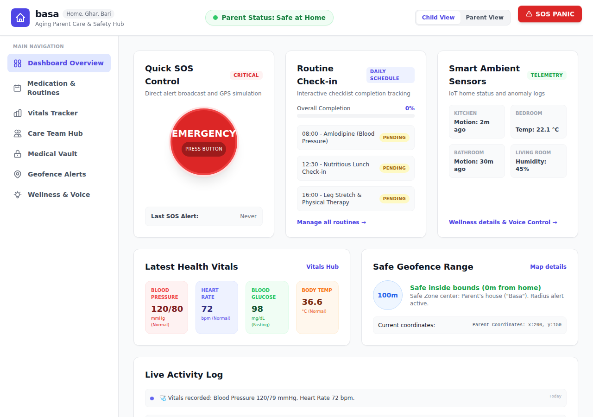

### Medication & Routines
Daily medication and routine checklists with completion progress bars.

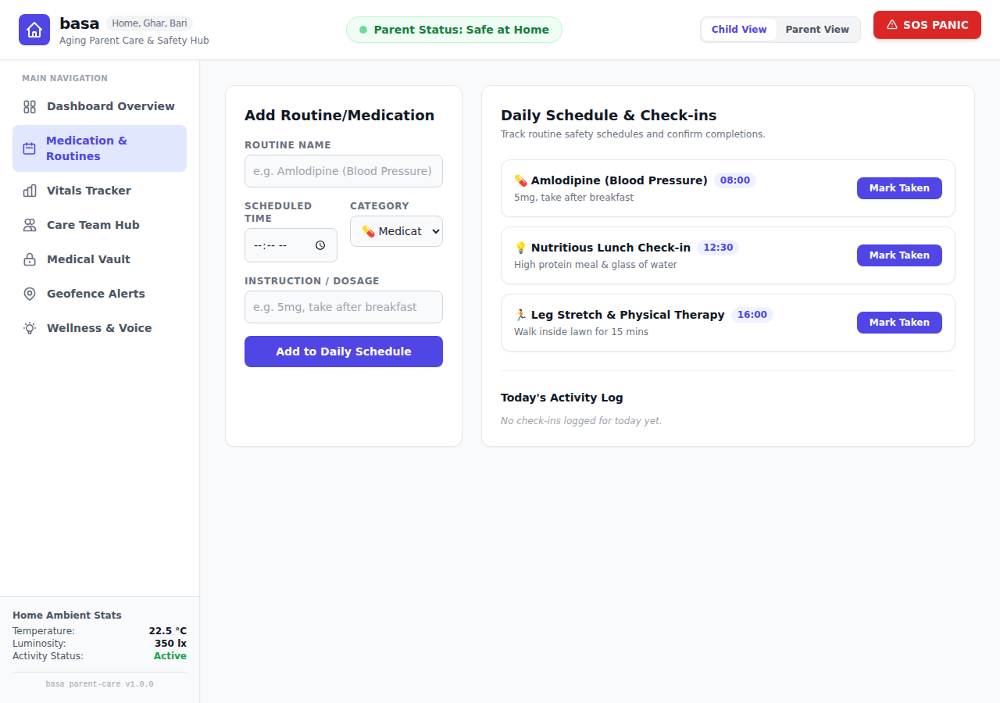

### Vitals Tracker
Blood pressure, pulse, glucose, and temperature logging with SVG trend charts and a historic readings table. Google Fit, Garmin and Whoop can be connected from the same tab; each connected platform contributes the metrics its devices measure and **Sync Now** merges them into today's reading.

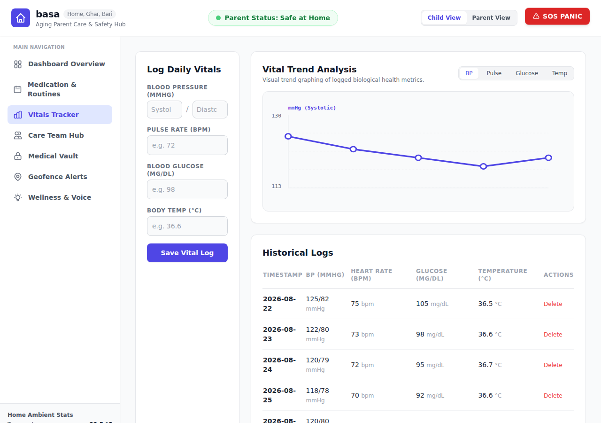

### Care Team Hub
Shared caregiver workspace for coordinating appointments, shift notes, and live caregiver updates.

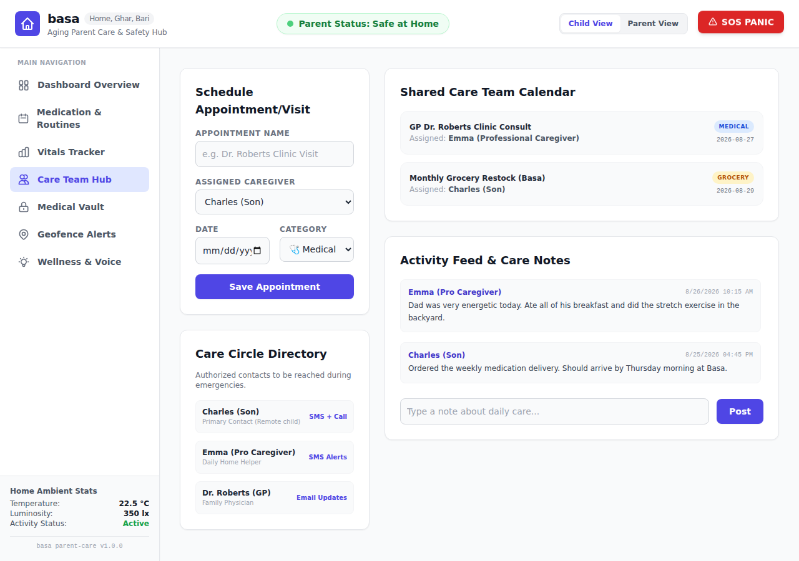

### Medical Vault
Categorized, searchable archive of health reports, prescriptions, and insurance documents.

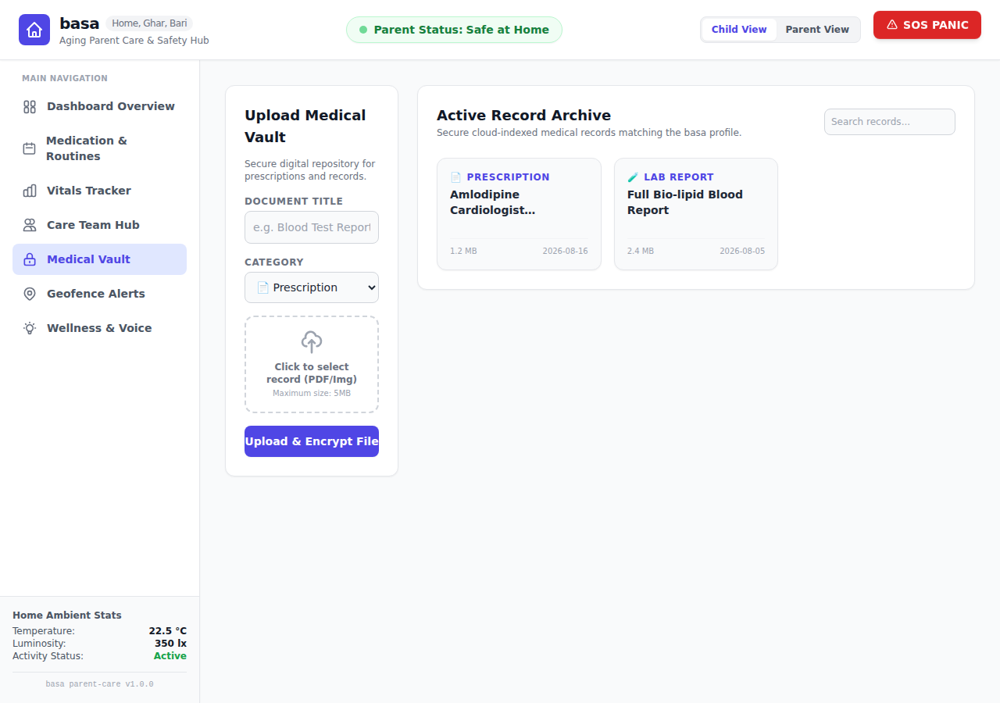

### Geofence Alerts
Configurable safe-zone radius with wandering simulation that triggers automatic alerts.

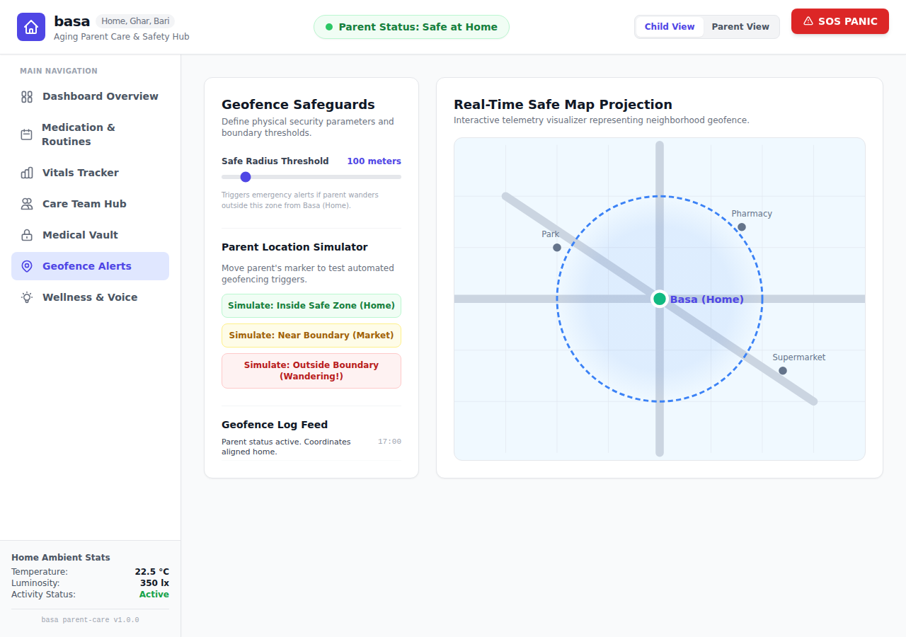

### Wellness & Voice
Brain-training memory match game plus live speech-to-text voice commands (Web Speech API) for hands-free routine updates, with a typed fallback.

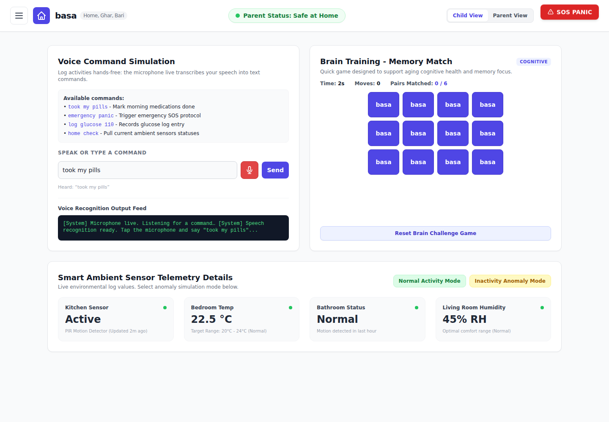

### Languages (English, Hindi, Bengali)
The header language picker translates the interface into Hindi (हिन्दी) or Bengali (বাংলা); untranslated phrases fall back to English.

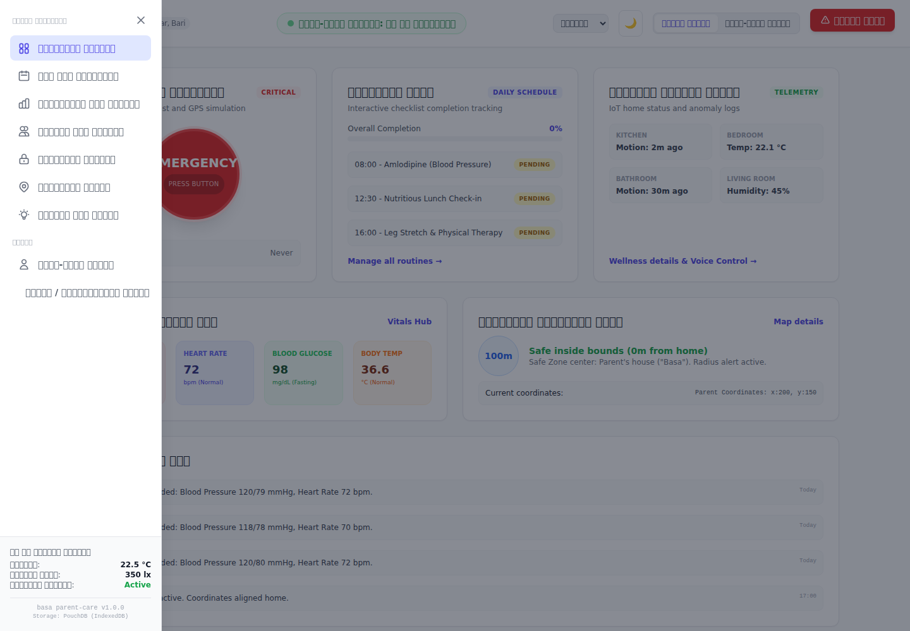

### Dark Mode
A header toggle switches the whole dashboard between the light and dark colour scheme.

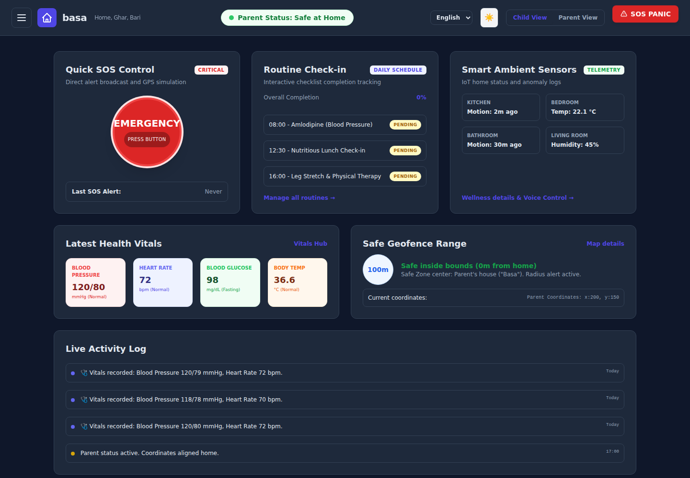

### Hamburger Navigation
The main navigation is tucked behind the header hamburger button and slides in as a drawer, closing on selection, backdrop click, or `Esc`.

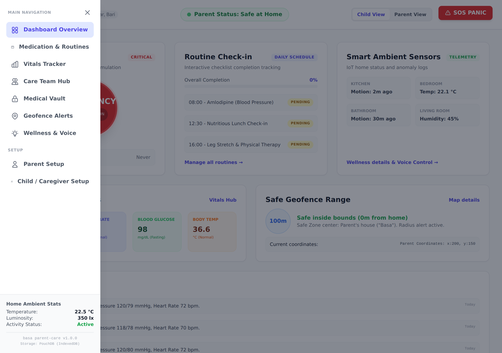

### Parent Setup
Capture the parent's identity, home address, medical background and accessibility preference.

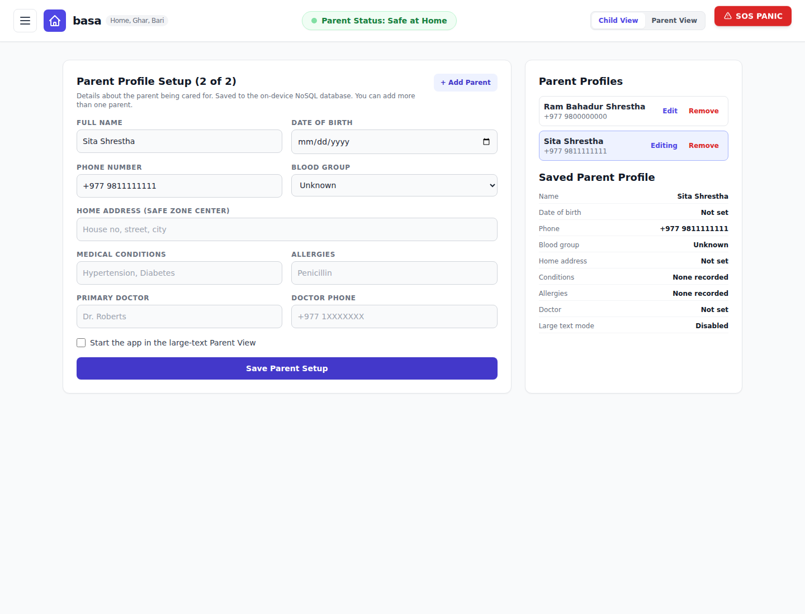

### Child / Caregiver Setup
Caregiver contact details, a backup contact, and per-channel alert preferences.

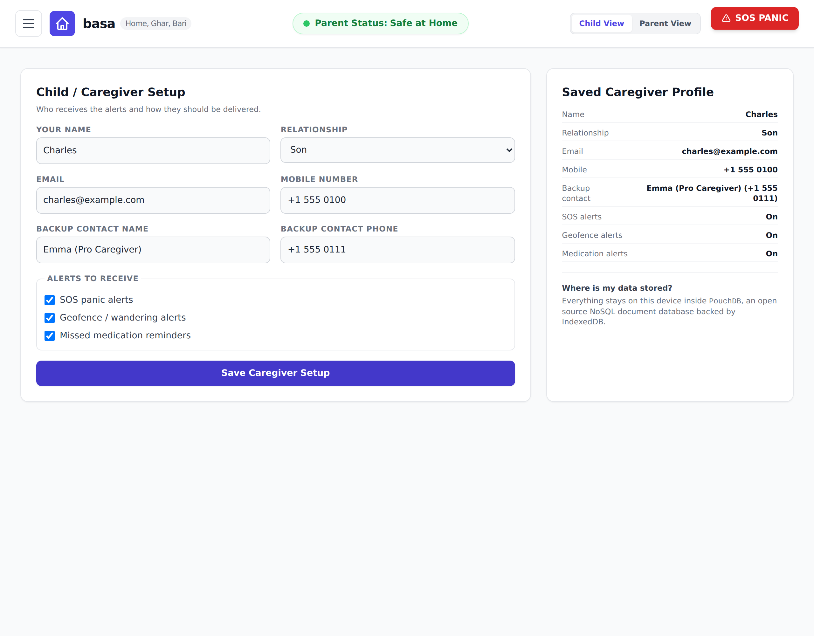

### Local Emergency Numbers
Police, ambulance and fire numbers for the country detected from the visitor's IP address, with a manual override. Tapping a card dials the number on mobile devices.

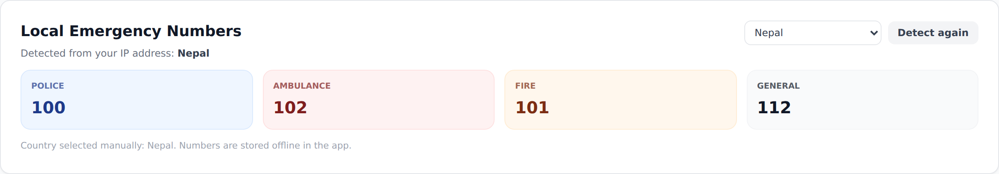

### Mobile & Responsive Layout
The dashboard adapts from phones to desktops: the header wraps into compact rows, the sidebar becomes a horizontally scrollable tab strip, cards stack into a single column, and wide tables scroll horizontally instead of breaking the page.

| Overview (mobile) | Vitals (mobile) |
| :---: | :---: |
| 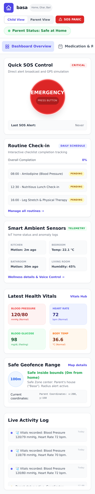 | 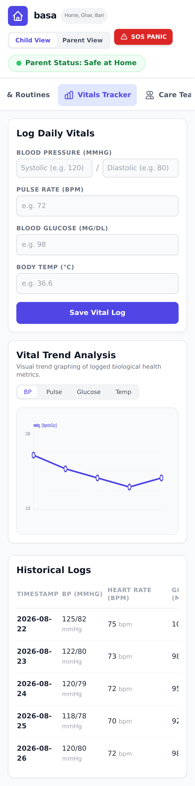 |

The same hamburger drawer is used on phones:

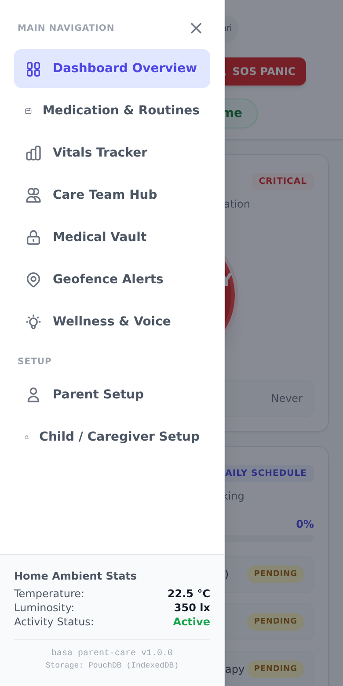
